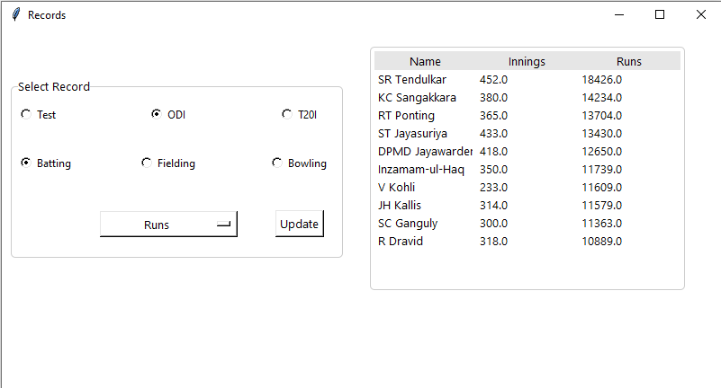

# Records Dashboard

This small project is inspired by Crickbuzz reords dashboard. I took the data from `cricket-records` database at Kaggle and built my GUI on top of that. It uses skills like

* Data Cleaning 
* Data Loading 
* Backend support for GUI applications. 





To run this dashboard:

```cmd
python main.py
```

Open to Contributions and improvement suggestions. Thank you!

> Note: Data is only accurate till 2019.